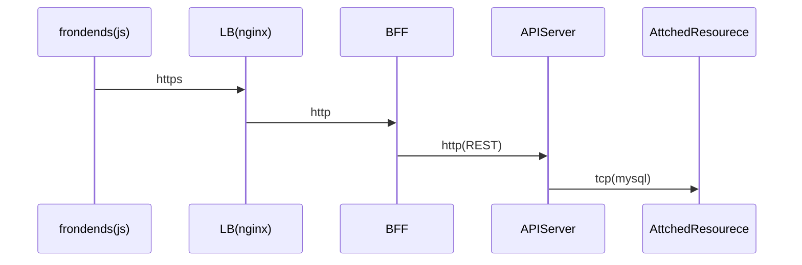
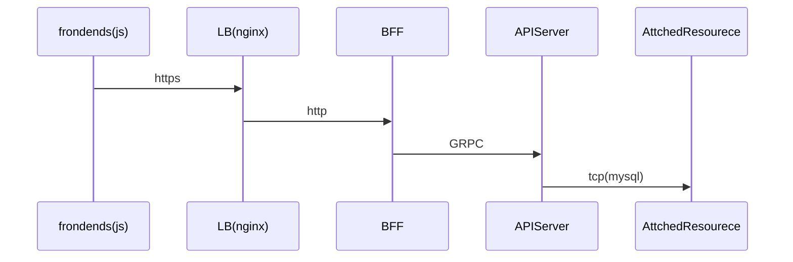
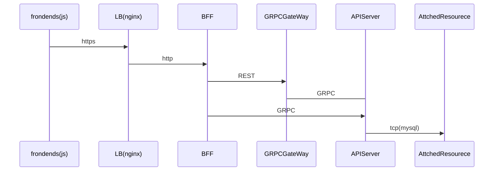

# k8sでBFF 環境の構築

## 目的

今までの総まとめとして BFF 環境の Mock を作成する

- Backends For Frontends が HttpClient で実装できる場合

- Backends For Frontends が GRPClient で実装できる場合

- Backends For Frontends が 両方混在する場合

## タスク

- 各モジュール作成
- Docker イメージ
- Helm
- CI&CD
- 監視
- バッチ処理

## 作業内容概要

### 各モジュール作成

- frondend
- bff-grpc
- backend-api
- bff-http
- grpc-gateway

### Docker イメージ

- nginx
- proxysql
- mysql

### Helm

- nginx
- proxysql
- mysql

### CI(circleci)

各モジュールのunit testとdocker imageのbuildまで

### CD(予定は未定)

CircleCIがデブロイ先(docker for mac)まで届かないので省略

### 監視(予定は未定)

- prometeus
- graphana

### バッチ処理(予定は未定)

- CronJob
- k8sAPIを使ったシンプルなJobManager(シーケンシャルにJobを実行するやつ)
