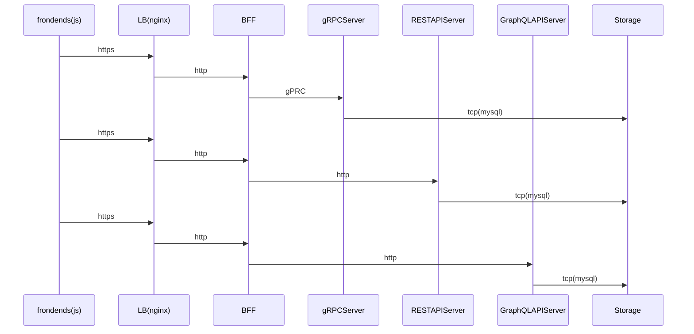

# k8sでBFF 環境の構築

## 目的

今までの総まとめとして BFF 環境の Mock を作成する

- Backends For Frontends が RESTful, gRPC, GraphQL のClientとして実装する




## Usage

```shell
# all resoource deploy
make deploy-all

# kubectl get all
make info-all

# kubectl port-forward (frontend-vue web-api prometeus grafana)
make forward-all

# open browser (frontend-vue prometeus grafana)
make open-all

# all resoource purge
make delete-all
```

## タスク

- ~~各モジュール作成~~
- ~~Docker イメージ~~
- ~~Helm~~
- 監視
- CI&CD
- バッチ処理
- envoyとか
- redisとか
- 追加でgraphqlやrest-serverとか
- いろいろリファクタ

## 作業内容概要

### 各helm chart作成

- [frontend-vue](https://github.com/taguch1/try-bff/tree/master/apps/frontend-vue)
- [web-api](https://github.com/taguch1/try-bff/tree/master/apps/web-api)
- [bff-server](https://github.com/taguch1/try-bff/tree/master/apps/bff-server)
- [grpc-server](https://github.com/taguch1/try-bff/tree/master/apps/grpc-server)
- [rest-server](https://github.com/taguch1/try-bff/tree/master/apps/rest-server)
- [graphql-server](https://github.com/taguch1/try-bff/tree/master/apps/graphql-server)
- [rdbms](https://github.com/taguch1/try-bff/tree/master/apps/rdbms)

### 監視(予定は未定)

- [prometheus](https://prometheus.io/)
- [grafana](https://grafana.com/)

### CI(予定は未定)

各モジュールのunit testとdocker imageのbuildまで

### CD(予定は未定)

CircleCIがデブロイ先(docker for mac)まで届かないので省略


### バッチ処理(予定は未定)

- CronJob
- k8sAPIを使ったシンプルなJobManager(シーケンシャルにJobを実行するやつ)
