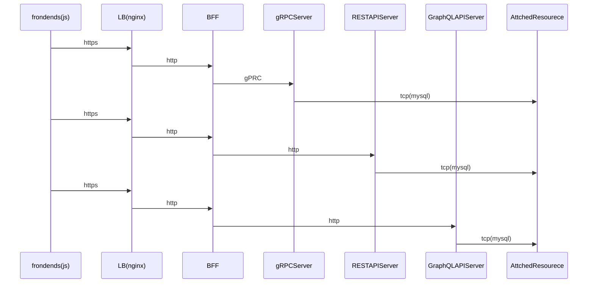

# k8sでBFF 環境の構築

## 目的

今までの総まとめとして BFF 環境の Mock を作成する

- Backends For Frontends が RESTful, gRPC, GraphQL のClientとして実装する

## タスク

- 各モジュール作成
- Docker イメージ
- Helm
- CI&CD
- 監視
- バッチ処理

## 作業内容概要

### 各モジュール作成

- [frondend](https://github.com/taguch1/try-bff/tree/master/apps/frondend)
- [bff-server](https://github.com/taguch1/try-bff/tree/master/apps/bff-server)
- [rest-server](https://github.com/taguch1/try-bff/tree/master/apps/rest-server)
- [grpc-server](https://github.com/taguch1/try-bff/tree/master/apps/grpc-server)
- [graphql-server](https://github.com/taguch1/try-bff/tree/master/apps/graphql-server)

### Docker イメージ

- nginx
- proxysql
- mysql

### Helm

- nginx
- proxysql
- mysql

### CI(circleci)

各モジュールのunit testとdocker imageのbuildまで

### CD(予定は未定)

CircleCIがデブロイ先(docker for mac)まで届かないので省略

### 監視(予定は未定)

- [prometheus](https://prometheus.io/)
- [grafana](https://grafana.com/)

### バッチ処理(予定は未定)

- CronJob
- k8sAPIを使ったシンプルなJobManager(シーケンシャルにJobを実行するやつ)

